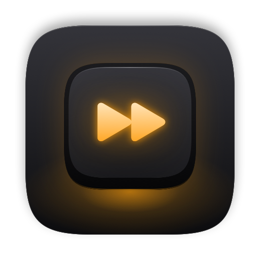
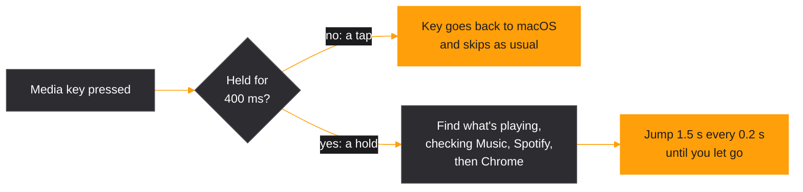

<div align="center">



# HoldSeek

**Tap to skip. Hold to seek.**

Hold the rewind or fast-forward key on your Mac to scrub through songs and videos.<br>
Tap it and it skips tracks, exactly like before.

[](#install)
[](HoldSeek.swift)
[](extension)
[](#privacy)
[](LICENSE)
[](https://buymeacoffee.com/anuragggg)

[Install](#install) · [Chrome](#chrome) · [How it works](#how-it-works) · [Troubleshooting](#troubleshooting) · [Build](#build) · [Support](#support)

</div>

<br>

## At a glance

| Key | Tap | Hold |
| :-- | :-- | :-- |
| <kbd>F9</kbd> fast-forward | Next track | **Seek forward** |
| <kbd>F7</kbd> rewind | Previous track | **Seek backward** |

These are the keys on Apple keyboards. Other keyboards' Next and Previous media keys work too.

| Works with | How |
| :-- | :-- |
| **Music** | Controlled directly. macOS asks you to allow it once. |
| **Spotify** | Controlled directly. macOS asks you to allow it once. |
| **Chrome** | YouTube, and any page with a video or audio player, through the companion extension. |

## Why HoldSeek

- **Taps stay native.** A quick tap goes straight back to macOS, so skipping works exactly as it does without HoldSeek.
- **Seeks the right player.** When you hold a key, HoldSeek finds whichever of Music, Spotify, or Chrome is actually playing, and sticks with it until you let go.
- **Tiny.** One Swift file with no dependencies. It's just a menu-bar icon, with no windows and nothing to set up beyond permissions.
- **Private.** HoldSeek never connects to the internet. [More below](#privacy).

## Install

> [!WARNING]
> HoldSeek isn't notarized by Apple, so macOS blocks a downloaded copy the first time you open it. You approve it once, or build it yourself and skip the warning.

### Download

1. Download `HoldSeek.zip` from [Releases](../../releases/latest), unzip it, and move **HoldSeek** to Applications.
2. Double-click HoldSeek. macOS says it can't verify the app. Click **Done**, not **Move to Trash**.
3. Open **System Settings → Privacy & Security** and scroll down to **Security**. Click **Open Anyway** next to the HoldSeek message, then confirm with your password.

You need to approve each new version this way. If you prefer Terminal, this command does the same as steps 2 and 3:

```sh
xattr -dr com.apple.quarantine /Applications/HoldSeek.app
```

### Build it yourself

> [!TIP]
> An app you build yourself opens without any warning.

You need Xcode's command-line tools (`xcode-select --install`). Then run:

```sh
git clone https://github.com/anuragggg/holdseek.git
cd holdseek
./build.sh
```

Move `build/HoldSeek.app` to Applications.

### First launch

1. Open HoldSeek. When macOS asks, give it **Accessibility** access in **System Settings → Privacy & Security → Accessibility**. HoldSeek needs this to catch the media keys.
2. The first time you hold a key while Music or Spotify is playing, macOS asks whether HoldSeek may control that app. Click **Allow**.

> [!NOTE]
> Newer versions of macOS call the Accessibility permission **Device Control and Data Access**.

The menu-bar keycap gives you **Enabled**, **Launch at Login**, **Install Chrome Extension…**, and **Quit**.

## Chrome

You set up the extension once. HoldSeek registers its Chrome connection by itself.

1. Click the HoldSeek icon in the menu bar and choose **Install Chrome Extension…**. A Finder window opens with the extension folder, and the folder's path is copied to your clipboard.
2. In Chrome, open `chrome://extensions` and turn on **Developer mode** in the top-right corner.
3. Click **Load unpacked**, press <kbd>⌘</kbd> <kbd>⇧</kbd> <kbd>G</kbd>, paste the path, and click **Select**.
4. Reload any tab that's already playing a video.

Once the extension is linked, the HoldSeek menu shows **Chrome Extension: Connected**.

## How it works



- HoldSeek catches the Next and Previous media keys before macOS does. If you hold a key with nothing playing, HoldSeek treats it as a tap.
- It controls Music and Spotify through their scripting support.
- For Chrome, the extension keeps track of which tab is playing. Chrome launches a small helper from HoldSeek that passes messages between the extension and the menu-bar app.

## Privacy

- HoldSeek makes no network connections and collects no analytics.
- **Accessibility** lets it catch the Next and Previous media keys. It passes every other key through untouched.
- **Automation** lets it read whether Music or Spotify is playing and move the playback position.
- The **Chrome extension** runs on every site so it can tell when a video or audio player starts or stops. On request from HoldSeek, it changes the playback position. It doesn't read page content.

Read the full [privacy policy and terms](PRIVACY.md).

## Troubleshooting

| Problem | Fix |
| :-- | :-- |
| Holding a key does nothing | Open the HoldSeek menu. If it shows **Grant Accessibility Access…**, HoldSeek doesn't have the permission yet. |
| HoldSeek is switched on in Accessibility but ignores the keys | That entry belongs to an older copy of HoldSeek, usually after an update or rebuild. Remove it with **−** and add the app again with **+**. |
| Chrome videos don't seek | The menu should show **Chrome Extension: Connected**. If it doesn't, set up the extension, then reload the video tab. |
| A hold skips the track instead of seeking | Nothing was playing when the hold started, so HoldSeek treated it as a tap. |

To see what HoldSeek is doing, watch its log while you press keys:

```sh
log stream --level debug --predicate 'subsystem == "com.holdseek.HoldSeek"'
```

## Build

```sh
./build.sh
```

This builds `build/HoldSeek.app` for both Apple Silicon and Intel Macs, plus `build/HoldSeek.zip` to attach to a release. It also runs a self-check of the tap and hold logic.

`build.sh` signs with the first certificate in your keychain, so macOS keeps the Accessibility permission when you rebuild. Without a certificate it signs ad hoc, and you'll need to remove and re-add HoldSeek in Accessibility after each rebuild.

If you have a Developer ID (part of the paid Apple Developer Program), you can notarize the build, so downloads open without the warning:

```sh
SIGN_ID="Developer ID Application: Name (TEAMID)" NOTARY_PROFILE=holdseek ./build.sh
```

To change the icon, edit `icon.swift` and run `swift icon.swift`. It regenerates the app icon, the extension icon, and the image at the top of this page.

| File | What it does |
| :-- | :-- |
| [`HoldSeek.swift`](HoldSeek.swift) | The whole app: key listener, tap and hold logic, players, Chrome helper, menu |
| [`extension/`](extension) | The Chrome extension, which tracks which tab is playing and seeks it |
| [`build.sh`](build.sh) | Builds, signs, and optionally notarizes the app |
| [`icon.swift`](icon.swift) | Draws the app icon |

## Limits

- The Touch Bar and headphone buttons don't send keyboard events, so HoldSeek can't see them.
- Only Google Chrome is supported. Other Chromium browsers, such as Brave, Edge, or Arc, look for the extension's connection in their own folders.
- The extension's ID is fixed by the `key` in `extension/manifest.json`. If the extension is ever published to the Chrome Web Store, it will get a new ID. That ID then needs adding to `extensionID` in `HoldSeek.swift`.

## Contributing

Ideas and fixes are welcome. Please read [CONTRIBUTING.md](CONTRIBUTING.md) first, and open an issue before starting anything big. To report a security problem privately, see [SECURITY.md](SECURITY.md).

## License

HoldSeek is released under the [MIT License](LICENSE).

## Support

HoldSeek is free. If it saves you some scrubbing and you'd like to say thanks, you can buy me a coffee.

<a href="https://buymeacoffee.com/anuragggg"></a>

<br>

<div align="center">
<sub>Built with Swift and AppKit. No Electron, no dependencies.</sub>
</div>
